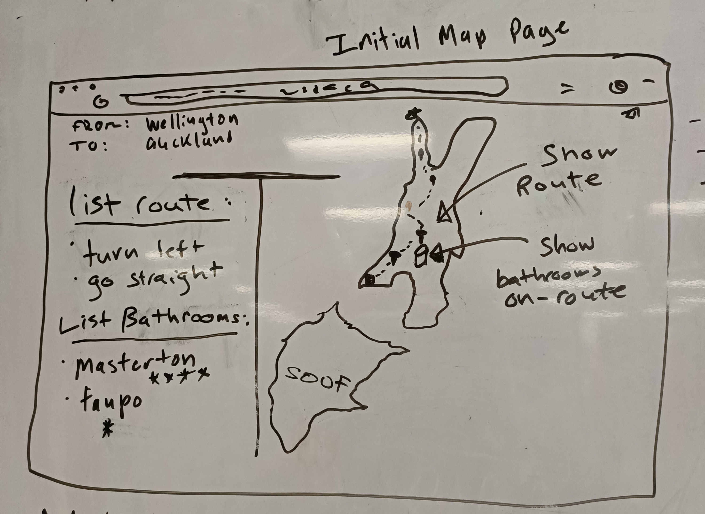

# Cheeky Roadtrip Readme!

## Team Doc Below - MVP,  Team Stress Profiles, Roles e.t.c
https://docs.google.com/document/d/1G1vxb_tp2uqvVKinbZbWiEapFCZpSqPEerkcmeP-hlw/edit


## Setup

Run the following commands in your terminal:

```sh
npm install
npx knex migrate:latest
npx knex seed:run
```

make sure you have in your .env:

```sh
JWT_SECRET="<the special password we put in here ;)>"
```

To run in development: (make sure you have a .env file)
```sh
npm run dev
```

To run in production:
```sh
npm start
```


## Wireframes

##### Landing Page


##### Inital Map Page / Roadtrip Page




## Useful boilerplate stuff that was removed

* FoundForm
* LostForm

### to delete

* apis/foundpets
* /actions/lost


## Heroku!!!

### Creating your app

Create your app with `heroku create [name]`

You can check that this was successful by running `heroku apps` to view a list of your apps


### Adding postgres

Add postgresql (hobby dev) to your app at `https://dashboard.heroku.com/apps/[APP NAME HERE]/resources`

Check that pg has been added by running `heroku addons` to ensure the postgresql db is on your app


### Deploying!

I have created several npm scripts that will be useful for deploying your app to heroku easily.

To push your local master branch to your heroku app:
```sh
npm run h:deploy
```

Run heroku migrations:
```sh
npm run h:migrate
```

Run heroku seeds:
```sh
npm run h:seed
```

If ever you need to rollback, you can also:
```sh
npm run h:rollback
```


### Ta-Da!
Your app should be deployed!


